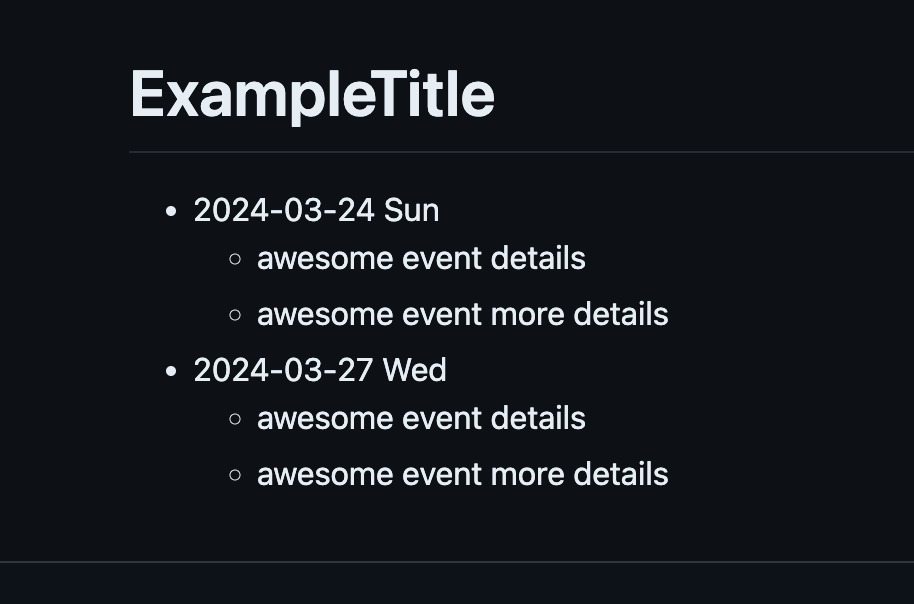
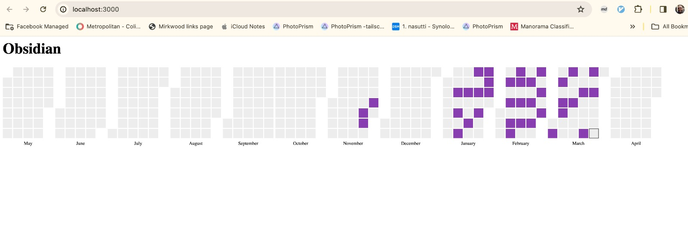

# Markdown Cal Heatmap

Create cal-heatmap from markdown logs.

Convert a markdown like:



To heatmap:



```
npm init -y
npm install unified unified-stream remark-parse remark-rehype rehype-stringify


node index.js example.md

```

```
node index-daily.js -d ~/src/obsidian-vault2/Daily\ Notes -f cardio
```
